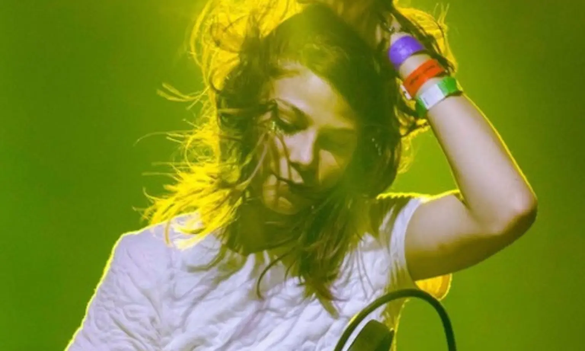

# Isabella I. Douzoglou Muñoz

**Communicator | Teaching Assistant @ MIT | Quantum Café co-founder**

🌐 **[douzog.github.io](https://douzog.github.io/)**

[MIT Open Learning](https://openlearning.mit.edu/) · [Quantum Café](https://quantumcafe.io/) · [laser neuron™](https://laserneuron.ai/) · [University of Amsterdam](https://www.uva.nl/en) · [University of Miami](https://welcome.miami.edu/)

---

## About

Hi! I'm Isabella! I'm an interdisciplinary scientist, currently a TA at MIT co-developing a machine learning course. Computer science allowed me to explore bioinformatics, systems biology, machine learning, physics, biophysics, neuroscience, and optical computing.

My missions are to help scientists, build community, and communicate science that anyone can understand. I co-founded the [Quantum Café](https://quantumcafe.io/), a quarterly gathering for science communication between Boston and Berlin as part of that mission.

Driven by curiosity and creativity!

---

## Experience

### Massachusetts Institute of Technology (MIT)

**Teaching Assistant** · Cambridge, USA · *07/2026 – Present*

- Co-develop an MIT Open Learning lecture on AI applied to complex and living systems, building the data visualizations and science-communication content for technical and non-technical audiences.
- Use Python, Jupyter, and generative AI to produce course material, partnering with a postdoc on lecture recording and revision.

### [Quantum Café](https://quantumcafe.io/), Quantum Technology Community Platform

**Co-Founder** · Cambridge, USA · *02/2026 – Present*

- **Host quarterly gatherings for scientists, ideas and the curious across Boston, Berlin, and Zürich, featuring lead scientists from NVIDIA and QuEra, researchers from Harvard, MIT, CERN, and the Max Planck Institute, and VCs from both ecosystems.** [See the events timeline](https://quantumcafe.io/#timeline).
- Created the Quantum Café brand identity and manage the website and YouTube content, building on foundations established through Laser Neuron™.
- Build and maintain the platform's network, coordinating researchers, educators, and technology organizations into an active university–industry ecosystem.

### [Laser Neuron™](https://laserneuron.ai/) (Stealth Optical Computing Startup)

**Founder & CEO** · Berlin, Germany · *06/2025 – 02/2026*

- Led a 12-person team of scientists and engineers scaling optical neural networks for telecommunications, across hardware, software, and research.
- **Delivered four public pitches and 40+ meetings with top-tier VC funds, taking 1st place at Photonics Days 2025 Berlin and 2nd place at Venture Vibe Deep Tech Summit.**
- Initiated collaborations with IBM Research Zurich, the Fraunhofer Institute, and Harvard spin-off Lumina Corp, and built an advisory board spanning IBM leadership and MIT and Harvard researchers.

### Max Delbrück Center for Molecular Medicine (MDC / BIMSB)

**Graduate Researcher** · Berlin, Germany · *12/2020 – 09/2024*

- Researched Tau-protein biomolecular condensates using single-molecule spectroscopy, fluorescence-lifetime imaging (FLIM), fluorescence correlation spectroscopy, and anisotropy, toward a propagation model of Alzheimer's disease.
- Quantified liquid–liquid phase-separation dynamics under varying ionic strength, molecular crowding, and cellular internalization, including interactions with the plasma membrane.
- Built ML-automated pipelines (Python, PyTorch, SciPy, Pandas, HDF5) for TCSPC data, covering curve-fitting, phasor analysis, ANOVA/PCA statistics, and quantitative image analysis of tau internalization.
- Ran wet-lab work end-to-end: recombinant-protein expression and purification (SEC), bacterial cell culture, site-directed mutagenesis, and maleimide fluorescent labeling.
- Dissertation in final writing phase; defense pending. Supervised by Dr. Nico Scherf and Prof. Dr. Kathrin de la Rosa.

### European Space Agency (ESA / ESTEC)

**Data Science Research Intern** · Noordwijk, Netherlands · *04/2020 – 08/2020*

- Searched for undetected fullerenes (C₆₀, C₇₀, C₇₀⁺) in the interstellar medium within the ESO EDIBLES absorption-spectroscopy dataset.
- Built a Python pipeline to process FITS spectra, applying barycentric and interstellar velocity corrections and a custom 0.02 Å binning method. This pushed detection sensitivity below 0.2% of the continuum. Code released openly on GitHub.
- Applied SciPy Butterworth denoising with forward–backward filtering and set abundance upper limits implying fullerene hydrogenation. Supervised by Prof. Dr. Bernard H. Foing.

### Technische Universität Dresden

**Research Intern** · Dresden, Germany · *09/2020 – 10/2020*

- Authored a literature review of computer-graphics and molecular-dynamics simulation algorithms for whole-cell simulation, across ~30 primary sources.
- Surveyed Monte Carlo integration, particle systems, and fluid dynamics (Navier-Stokes, material point methods, GPU sparse-volume solvers), and proposed coarse-grained hybrid approaches for full-cell simulation. Supervised by Dr. Nico Scherf.

### University of Amsterdam (IMCN Research Unit)

**Deep Learning Research Intern** · Amsterdam, Netherlands · *06/2019 – 03/2020*

- Developed an unsupervised deep-learning pipeline using Variational Autoencoders (PyTorch) to segment grey and white matter in brain histology, supporting the first digital 3D atlas of the cerebral subcortex.
- Built an automated pre-processing pipeline (Python, PIL, NumPy) from Thionine-stained TIFF slices and designed a convolutional VAE. → [View code on GitHub](https://github.com/douzog/VAE_IMCNResearchUnit_Thesis)
- Evaluated latent representations with t-SNE, PCA, and K-means, validated by permutation testing, reaching 78% classification accuracy on unseen data. Supervised by Prof. Dr. Birte U. Forstmann.

---

## Additional Experience

### KOMA Elektronik

**Production Engineer & Media** · Berlin, Germany · *04/2017 – 2018*

- Contributed to electronics production and created YouTube video/audio content demonstrating the company's synthesizers, recording, editing, and generating social-media content.

### Zaniac

**Instructor** · USA · *10/2015 – 05/2016*

- Taught K–8 students mathematics, computer programming, and computer games, developing individualized curricula adapted to each child.

### Douzoglou Uchi LLC

**Founder & CEO** · International · *12/2013 – Present*

- Independent international musician performing across North America, Mexico, Israel, and Europe, playing live sets with synthesizers, samplers, mixers, and effects, and recording collaborations worldwide. Represented in Europe by [LMNT agency](https://www.lmnt-agency.com/).

### University of Miami

**Sound Designer** · Miami, USA · *09/2013 – 12/2013*

- Composed and produced an original score and sound-effects library (Ableton Live, Pro Tools) for [Zoo Rush](https://news.miami.edu/stories/2014/08/interactive-medias-zoo-rush-wins-good-gaming-award-for-raising-sickle-cell-awareness.html), a serious game raising awareness of sickle-cell anemia.

### WVUM 90.5FM, University of Miami

**Promotions Director** · Miami, USA · *05/2011 – 05/2012*

- Represented the station to the Miami public by booking artists, running giveaways, promoting events, and maintaining label and promoter relationships.

---

## Education

| Degree | Institution | Year |
| --- | --- | --- |
| Ph.D. Candidate, Medical Science (Biophysics)<br>*Mentored by Prof. Dr. Kathrin de la Rosa* | Charité – Universitätsmedizin Berlin | Expected 2027 |
| M.Sc. Bioinformatics & Systems Biology *(Dual Degree)* | University of Amsterdam & Vrije Universiteit Amsterdam | 2020 |
| B.A. Computer Science | University of Miami | 2013 |
| B.S. Communications *(focus in motion pictures)* | University of Miami | 2013 |

---

## Talks and Presentations

**Quantum Café at the AGI House Hackathon**, *May 31, 2026*
The Engine, MIT · Cambridge, MA

Quantum + AI workshop hosted by [Quantum Café](https://quantumcafe.io/) at the AGI House Hackathon.
📄 [View slides (PDF)](talks/QuantumCafe-The-Engine-MIT-2026-05-31.pdf) · ▶️ [Watch the talk](https://www.youtube.com/watch?v=yM0X9YV_jBo&t=278s)

---

## Conferences and Courses

- [MolSim 2020](https://www.compchem.nl/molsim/2020/), molecular simulation school, [CompChem](https://www.compchem.nl/molsim/), Amsterdam. 2020.

---

## Publications

**The C-terminus of α-Synuclein Regulates its Dynamic Cellular Internalization by Neurexin 1β**
*Molecular Biology of the Cell*

---

## Articles

- Profiled in *Miami New Times*: ["How Miami DJ Uchi Found Harmony Between Tech and Techno"](https://www.miaminewtimes.com/music/how-miami-dj-uchi-found-harmony-between-tech-and-techno-40573585/).



*Photo: Rod Deal*

- Ranked No. 4 in *Miami New Times*: ["Miami's Ten Best Local DJs"](https://www.miaminewtimes.com/music/miamis-ten-best-local-djs-8254881/).
- Covered in *Miami New Times*: ["Uchi's Cyborgs Party at Electric Pickle: Bring Your Own Laser Beams"](https://www.miaminewtimes.com/music/uchis-cyborgs-party-at-electric-pickle-bring-your-own-laser-beams-6437652/).

---

## Awards & Honors

- First Place, [Photonics Days 2025, Berlin](https://optecbb.de/news-1/newsdetails/artikel/photonics-days-berlin-brandenburg-2025-a-record-breaking-success.html), and Second Place, [Venture Vibe Deep Tech Summit](https://www.tradingview.com/news/eqs:9472369d8094b:0-venture-vibe-deep-tech-summit-brought-together-over-300-innovators-in-berlin/) (laser neuron™).
- [MDC Exchange Fellowship](https://www.mdc-berlin.de/careers/development/graduate-school/mdc-nyu-phd-exchange) (formerly called MDC-NYU Exchange Program).
- [Moon Gallery Artist Candidate](https://moongallery.eu/artist/isabella-douzoglou/).

---

## Recordings

- [**Zro** (REITEN 2020)](https://reiten.bandcamp.com/track/zro)
- [**Sky Clair Remix** (REITEN 2019)](https://koseifukuda.bandcamp.com/track/sky-clair-uchi-remix)
- [**Lichtung Remix** (Plangent 2019)](https://plangentrecords.bandcamp.com/track/lichtung-uchi-remix)
- [**Rachel's Song** (Life and Death 2019)](https://lifeanddeathforever.bandcamp.com/track/rachels-song)
- [**Plangent#006** (Plangent 2016)](https://plangentrecords.bandcamp.com/album/plangent-006)
- [**Aeon Sky** (Plangent 2016)](https://plangentrecords.bandcamp.com/track/aeon-sky)

Full discography on [Spotify](https://open.spotify.com/artist/1QZWutRLoc8I5q8KA9hNOB).

---

## Live Sets

- [**Boiler Room Tulum x Comunite**, live set, 13 January 2016](https://youtu.be/ACqcA3IM3Mk)
- [**Boiler Room Machines Berlin**, with Speedy J, Alex the Fairy, Rachel Lyn, Volruptus](https://youtu.be/u6_-17uMHjg)
- [**Instagram**, @uchi, tour dates and clips](https://www.instagram.com/uchi_____________la_uchi)

---

## Notable Performances

| Date | Venue | Detail | City |
| --- | --- | --- | --- |
| 10 Aug 2018 | Säule, Berghain | Säule XVII | Berlin |
| 11 May 2018 | De School | Culture Program, ambient / live | Amsterdam |
| 25 Jan 2018 | BL_K NOISE x Raster Label Showcase | Lot 613 | Los Angeles, California |
| 5–6 Jan 2018 | Comunité Festival | Live set, underground electronic program | Tulum, Mexico |
| 22 Dec 2017 | Output | Grayscale, live, with Anthony Parasole, Vril, Ø [Phase], and Cosmin TRG | Brooklyn, New York |
| 23 Nov 2017 | Kantine am Berghain |  | Berlin |
| 10 Aug 2017 | Säule, Berghain | Säule VI | Berlin |
| 28 Apr 2017 | De School | De Club, with JP Enfant | Amsterdam |
| 12 Jan 2017 | Kantine am Berghain | Night Moves | Berlin |
| 27 May 2016 | Panorama Bar, Berghain | Finest Friday | Berlin |
| 13 Jan 2016 | Comunité Festival | Boiler Room live set | Tulum, Mexico |
| 9 Oct 2015 | [III Points 2015](https://ra.co/events/728116) | Mana Wynwood | Miami, Florida |

Full gig history on [Resident Advisor](https://ra.co/dj/uchi).

---

## Beyond the Work

I love horses, dancing, and learning.

---

## Get in Touch

Please feel free to reach out!

- ✉️ [isabella@laserneuron.ai](mailto:isabella@laserneuron.ai)
- 💼 [LinkedIn](https://www.linkedin.com/in/isabella-i-douzoglou-mu%C3%B1oz-b7953b6b/)
- 💻 [GitHub](https://github.com/douzog)
- 📸 [Instagram](https://www.instagram.com/douzog)

---

## About this repository

Source for [douzog.github.io](https://douzog.github.io/), a static site with no build step or dependencies, served by GitHub Pages.

| Path | Contents |
| --- | --- |
| `index.html` | the page |
| `styles.css` | all styling |
| `script.js` | navigation, scroll animations, email obfuscation |
| `Logos/` | institution and project logos |
| `Photos/` | photographs used on the page |
| `talks/` | slide decks linked from Talks and Presentations |

Run it locally from the repo root:

```sh
python3 -m http.server 8000
```

Then open <http://localhost:8000>.

© Isabella I. Douzoglou Muñoz. All rights reserved.
